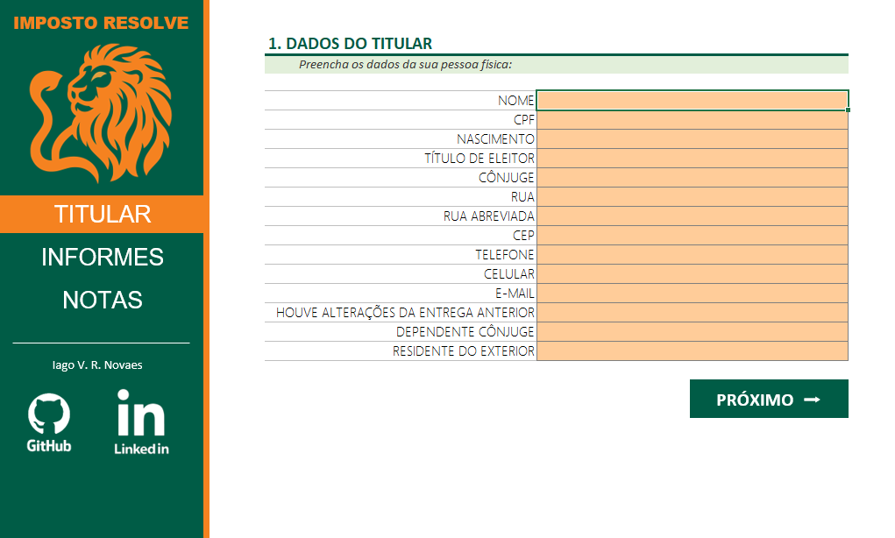
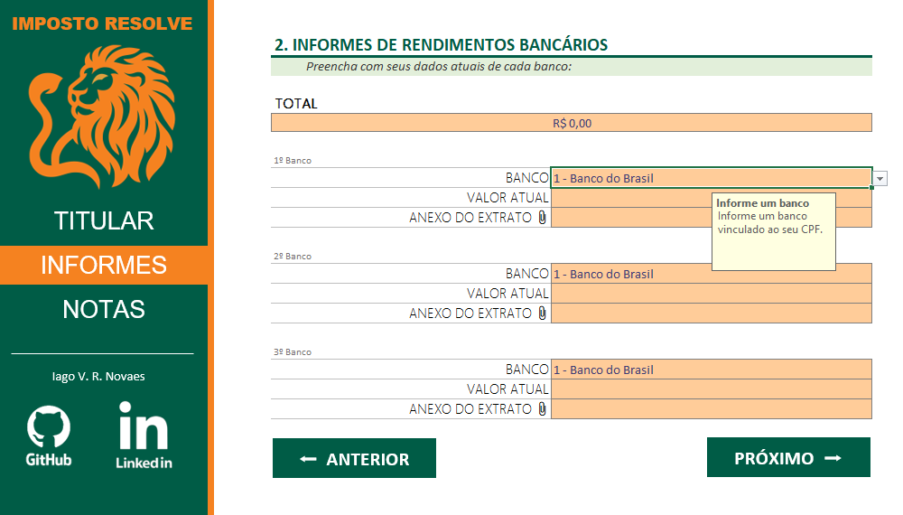
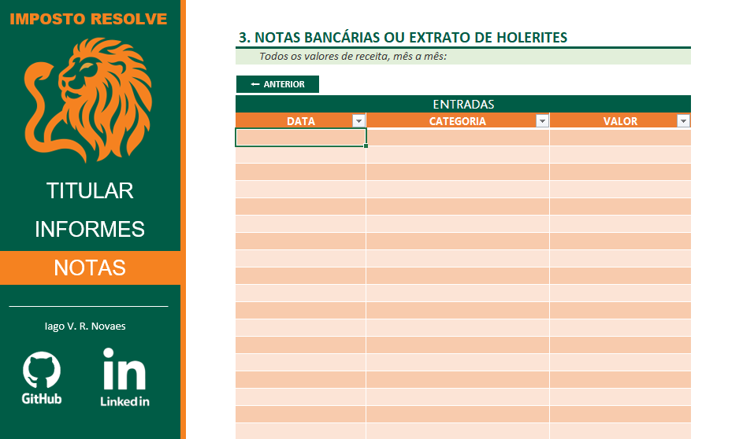

# Imposto Resolve

O **Imposto Resolve** é um projeto que tem como objetivo criar uma ferramenta prática e organizada para auxiliar na **declaração do Imposto de Renda**, com versões compatíveis com **Microsoft Excel** e **LibreOffice Calc**.

A proposta é oferecer um **agregador de dados** no qual o usuário possa reunir, validar e organizar todas as informações essenciais exigidas pela Receita Federal, reduzindo erros, retrabalho e esquecimentos durante o preenchimento da declaração.

## 🎯 Objetivo do Projeto

Criar uma planilha robusta, mas ao mesmo tempo **simples e intuitiva**, que permita ao usuário:

- Centralizar informações relevantes do IR
- Controlar entradas de dados de forma eficiente
- Minimizar inconsistências com validações automáticas
- Navegar facilmente entre as seções do documento

## 🧩 Funcionalidades

- Menus de navegação entre planilhas
- Estrutura organizada por tipo de informação
- Campos pensados para facilitar a conferência posterior
- Links rápidos e recursos auxiliares
- Interface amigável e prática

## 🗂️ Estrutura das Planilhas

### 👤 Titular
Planilha destinada aos dados principais do contribuinte, servindo como base para toda a organização da declaração.

---

### 📄 Informes
Espaço para registrar informes de contas bancárias.

---

### 🧾 Notas
Planilha voltada para o controle de notas.

## 🛠️ Compatibilidade

- Microsoft Excel  
- LibreOffice Calc  

## 🚀 Status do Projeto

Em desenvolvimento, com foco em melhorias contínuas de usabilidade, validações e recursos adicionais.

---

💡 **Sugestões, melhorias e contribuições são bem-vindas!**
